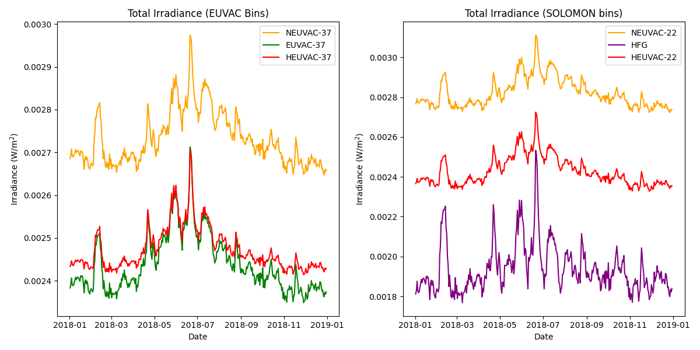
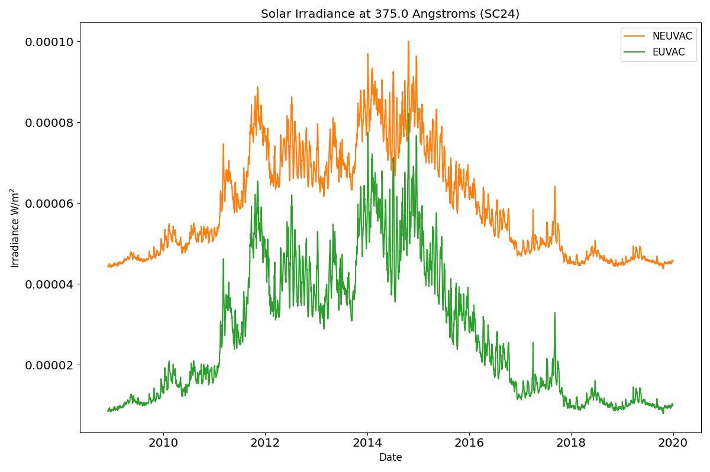
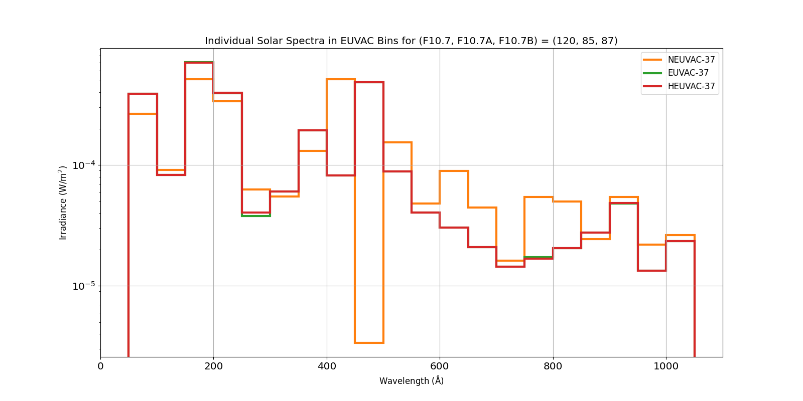
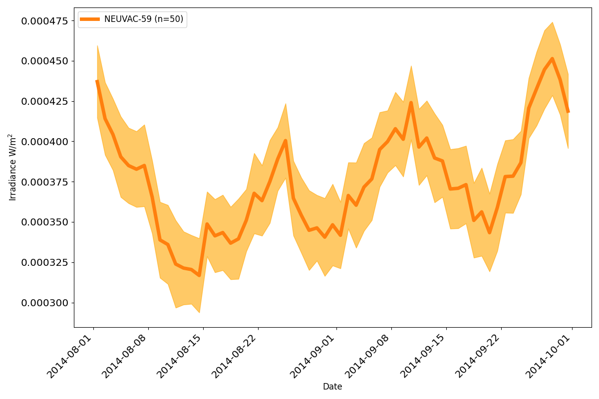

Examples
==========

EUVpy can be used to generate EUV irradiance outputs for different models and in different wavelength binning schemes.
A few examples of using its major capabilities are below.

Running Different EUV Models in General
---------------

EUVpy contains 4 different solar EUV models: EUVAC, HEUVAC, HFG, and NEUVAC. Each of these models is parameterized in
terms of the 10.7 cm solar radio flux (F10.7), or a quantity derived from F10.7. As a result, in order to run any of the
aforementioned models, the user must first obtain F10.7 measurements. This can be done as follows:

.. code-block:: python

    # Top level imports
    import numpy as np
    import matplotlib.pyplot as plt
    import matplotlib
    matplotlib.use('Qt5Agg')

    # Local imports:
    from EUVpy.tools import processIndices
    from EUVpy.NEUVAC import neuvac
    from EUVpy.empiricalModels.models.EUVAC import euvac
    from EUVpy.empiricalModels.models.HEUVAC import heuvac
    from EUVpy.empiricalModels.models.SOLOMON import solomon

    # Global Plotting Settings:
    import matplotlib.pylab as pylab
    params = {'legend.fontsize': 'large',
              'figure.figsize': (16, 8),
             'axes.labelsize': 'large',
             'axes.titlesize':'x-large',
             'xtick.labelsize':'x-large',
             'ytick.labelsize':'x-large'}
    pylab.rcParams.update(params)

    # Get some F10.7 for the entirety of 2018
    f107times, f107, f107a, f107b = processIndices.getCLSF107('2018-01-01', '2018-12-31', truncate=False)

After obtaining F10.7 data, the different models can then easily be executed:

.. code-block:: python

    # Call the models in the EUVAC bins!
    neuvacIrr, _, _, _ = neuvac.neuvacEUV(f107, f107b, bands='EUVAC')
    euvacFlux, euvacIrr, _, _, _ = euvac.euvac(f107, f107a)
    heuvac_wav, heuvacFlux, heuvacIrr, _, _, _ = heuvac.heuvac(f107, f107a, torr=True)

    # Call the models in the SOLOMON bins!
    neuvacIrrSolomon, _, _, _ = neuvac.neuvacEUV(f107, f107b, bands='SOLOMON')
    solomonFluxHFG, solomonIrrHFG = SOLOMON.solomon.solomon(f107, f107a, model='HFG')
    solomonFluxEUVAC, solomonIrrEUVAC = SOLOMON.solomon.solomon(f107, f107a, model='EUVAC')

    # Plotting:
    fig, ax = plt.subplots(nrows=1, ncols=2, figsize=(12, 6))
    # Left plot will be total irradiance in the EUVAC bins
    ax[0].plot(f107times, np.sum(neuvacIrr, axis=-1), label='NEUVAC-37', color='orange')
    ax[0].plot(f107times, np.sum(euvacIrr, axis=-1), label='EUVAC-37', color='green')
    ax[0].plot(f107times, np.sum(heuvacIrr, axis=-1), label='HEUVAC-37', color='red')
    ax[0].set_ylabel('Irradiance (W/m$^2$)')
    ax[0].set_xlabel('Date')
    ax[0].set_title('Total Irradiance (EUVAC Bins)')
    ax[0].legend(loc='best')
    # Right subplot will be total irradiance in the SOLOMON bins
    solomonTable = solomon.solomonTable
    mids = 0.5*(solomonTable[:, 1] + solomonTable[:, 2])*10
    ind2 = 7
    ax[1].plot(f107times, np.sum(neuvacIrrSolomon, axis=-1), label='NEUVAC-22', color='orange')
    ax[1].plot(f107times, np.sum(solomonIrrHFG, axis=-1), label='HFG', color='purple')
    ax[1].plot(f107times, np.sum(solomonIrrEUVAC, axis=-1), label='HEUVAC-22', color='red')
    ax[1].set_ylabel('Irradiance (W/m$^2$)')
    ax[1].set_xlabel('Date')
    ax[1].set_title('Total Irradiance (SOLOMON bins)')
    ax[1].legend(loc='best')
    fig.tight_layout()
    plt.show()

The resulting picture from running the above code should look like the following figure below:

Time Series of Solar EUV Irradiance
---------------

It can also be useful to look at the evolution of solar EUV in a specific wavelength band over time. As in the preceding
example, we start by obtaining F10.7 data. We will consider a longer stretch of time, and restrict ourselves to
comparing EUVAC and NEUVAC:

.. code-block:: python

    # Get some F10.7 data for the entirety of Solar Cycle 24:
    f107times, f107, f107a, f107b = processIndices.getCLSF107('2008-12-01', '2019-12-31', truncate=False)

    # Call the models:
    neuvacIrradiance, _, _, _ = neuvac.neuvacEUV(f107, f107a)
    euvacFlux, euvacIrr, _, _, _ = euvac.euvac(f107, f107a)

    ind = 11
    mids = 0.5*(euvac.euvacTable[:, 1] + euvac.euvacTable[:, 2])
    plt.figure(figsize=(12, 8))
    plt.plot(f107times, neuvacIrradiance[:, ind], label='NEUVAC', color='tab:orange')
    plt.plot(f107times, euvacIrr[:, ind], label='EUVAC', color='tab:green')
    plt.legend(loc='best')
    plt.xlabel('Date')
    plt.ylabel('Irradiance W/m$^2$')
    plt.title('Solar Irradiance at '+str(mids[ind])+' Angstroms (SC24)')
    plt.tight_layout()
    plt.show()

The result should be the following figure:

Individual Solar Spectra
---------------

It can also be helpful at times to simply generate the entire spectrum for a particular model, so it may be examined.
To do so, we can simply consider some arbitrary values of F10.7, 81-day averaged F10.7, and 54-day averaged F10.7 in a
backwards-looking window:

.. code-block:: python

    # Sample values for F10.7, F10.7A, and F10.7B
    f107 = 120
    f107a = 85
    f107b = 87

Generally speaking, it's most convenient to view solar spectra in something like a `stair plot'. An example of this can
be found in Figure 8 of `Nishimoto, et al. 2021 <https://link.springer.com/article/10.1186/s40623-021-01402-7>`_. In
order to do that, we need to get the boundaries of the wavelength ranges. We can do that as follows:

.. code-block:: python

    from EUVpy.tools import toolbox
    euvacTable = euvac.euvacTable
    leftsides = euvacTable[:, 1]
    rightsides = euvacTable[:, 2]
    band_indices, band_boundaries = toolbox.band_info(leftsides, rightsides)

Let's compare the NEUVAC, EUVAC, and HEUVAC models:

.. code-block:: python

    neuvacIrr, _, _, _ = neuvac.neuvacEUV(f107, f107b, bands='EUVAC')
    euvacFlux, euvacIrr, _, _, _ = euvac.euvac(f107, f107a)
    heuvac_wav, heuvacFlux, heuvacIrr, _, _, _ = heuvac.heuvac(f107, f107a, torr=True)

    fig, ax = plt.subplots(nrows=1, ncols=1, sharex=True, sharey=True)
    ax.stairs(values=neuvacIrr[0, band_indices], edges=band_boundaries, label='NEUVAC-37', lw=3, color='tab:orange')
    ax.stairs(values=euvacIrr[0, band_indices], edges=band_boundaries, label='EUVAC-37', lw=3, color='tab:green')
    ax.stairs(values=heuvacIrr[0, band_indices], edges=band_boundaries, label='HEUVAC-37', lw=3, color='tab:red')
    ax.set_yscale('log')
    ax.legend(loc='best')
    ax.grid()
    ax.set_xlabel('Wavelength ($\mathrm{\AA}$)')
    ax.set_ylabel('Irradiance (W/m$^2$)')
    ax.set_title('Individual Solar Spectra in EUVAC Bins for (F10.7, F10.7A, F10.7B) = ('+str(f107)+', '+str(f107a)+', '+str(f107b)+')')
    plt.show()

The resulting image should look like the following:

Irradiance Ensembles
---------------
One of the powerful capabilities EUVpy provides is the ability to generate irradiance ensembles. An irradiance ensemble
consists of a collection of spectra constituting a distribution of irradiance values at each wavelength. To generate
such as distribution, we need to import the right module, and again start by obtaining F10.7 values:

.. code-block:: python

    from EUVpy.tools import ensemble

    # Obtain F10.7 values over a 2-month period:
    f107times, f107, f107a, f107b = processIndices.getCLSF107('2014-08-01', '2014-10-01', truncate=False)

We now simply execute the following code. Note that the argument 'iterations' specifies the number of ensemble members:

.. code-block:: python

    num_ensemble_members = 50
    ensemble_NeuvacIrr, ensemble_average_NeuvacIrr, ensemble_stddev_NeuvacIrr = ensemble.irradiance_ensemble(f107, f107b,
                                                                                                iterations=num_ensemble_members,
                                                                                                model='NEUVAC')

Now we can look at the entire ensemble by plotting a time series of all of the ensemble members:

.. code-block:: python

    # Plot the ensemble, with the confidence bands corresponding to the ensemble spread at 303.31 Angstroms:
    ind = 7
    plt.figure(figsize=(12,8))
    plt.fill_between(f107times, (ensemble_average_NeuvacIrr-ensemble_stddev_NeuvacIrr)[:, ind],
                                  (ensemble_average_NeuvacIrr+ensemble_stddev_NeuvacIrr)[:, ind],
                         color='orange', alpha=0.6)
    plt.plot(f107times, ensemble_average_NeuvacIrr[:, ind], label='NEUVAC-59 (n='+str(num_ensemble_members)+')', color='tab:orange', linewidth=5)
    plt.xlabel('Date')
    plt.ylabel('Irradiance W/m$^2$')
    plt.xticks(rotation=45, ha='right')
    plt.legend(loc='best')
    plt.tight_layout()
    plt.show()

The result should be a figure that looks like the following:

Preparing Files for Numerical Models
---------------

A final important capability provided by EUVpy are functions that enable NEUVAC outputs to be used directly be two
powerful upper atmospheric models: the Global Ionosphere Thermosphere Model (GITM) and Aether. These models already
have the ability to use EUVAC, HEUVAC, and HFG, but not so for NEUVAC. Therefore, EUVpy contains functions that enable
NEUVAC irradiances to be formatted into a file that can be directly supplied to GITM, and also contains a code for
outputting the NEUVAC model coefficients to a file that Aether can use to implement the model.

=================
GITM
=================

GITM requires an external input file that contains solar EUV irradiances covering the period of time a given simulation
is being run. To provide such a file contaning NEUVAC irradiances, we first simply obtain the F10.7 data over the
simulation interval, and then execute a single function call:

.. code-block:: python

    # Get some F10.7 during the 2015 St. Patrick's Day Geomagnetic Storm:
    f107times, f107, f107a, f107b = processIndices.getCLSF107('2015-03-16', '2015-03-26', truncate=False)

    # Generate the NEUVAC irradiance but output them to a file that can be used by GITM
    out = neuvac.gitmNEUVAC(f107times, f107, f107b)

After running the above code, you should see a command-line printed output telling you where the file is located. It
should at the following location ~/EUVpy/src/EUVpy/NEUVAC/irradiances/neuvac_euv_2015-03-16_to_2015-03-25.txt.

=================
Aether
=================

The Aether model is set up to use NEUVAC differently than GITM. Aether actually has machinery for computing irradiances
directly, but it requires a file with the coefficients for NEUVAC in order to do so. To do this, only a single line of
code is needed:

.. code-block:: python

    out = neuvac.aetherFile()

After running this code, a command-line printout should tell you where the resulting coefficents are located. They
should be in the following location: ~/EUVpy/src/EUVpy/data/euv_59_aether.csv.